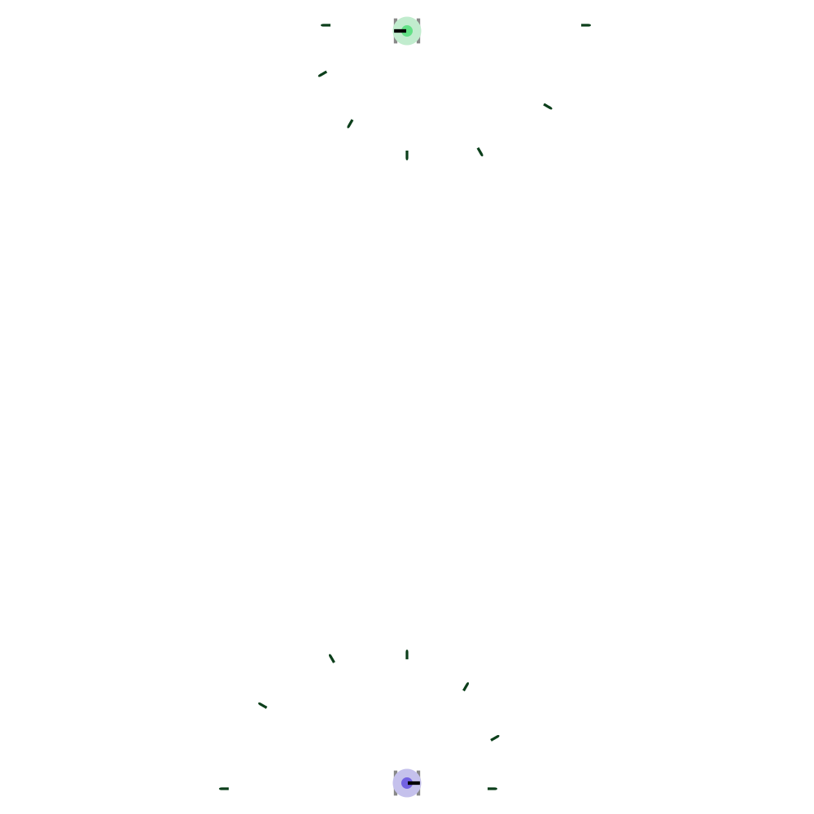

Tank
====

Tank is a small engine for a game simulating a fight between two tanks on a
playfield.

Tanks have limited fuel, missiles and mines.

The engine does not implement artificial intelligence controlling the tanks.

It generates SVG output of the playfield state.

